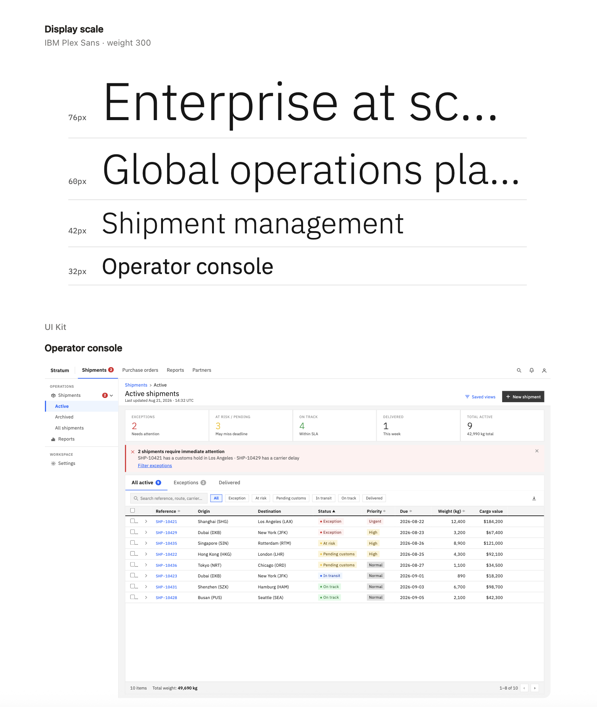
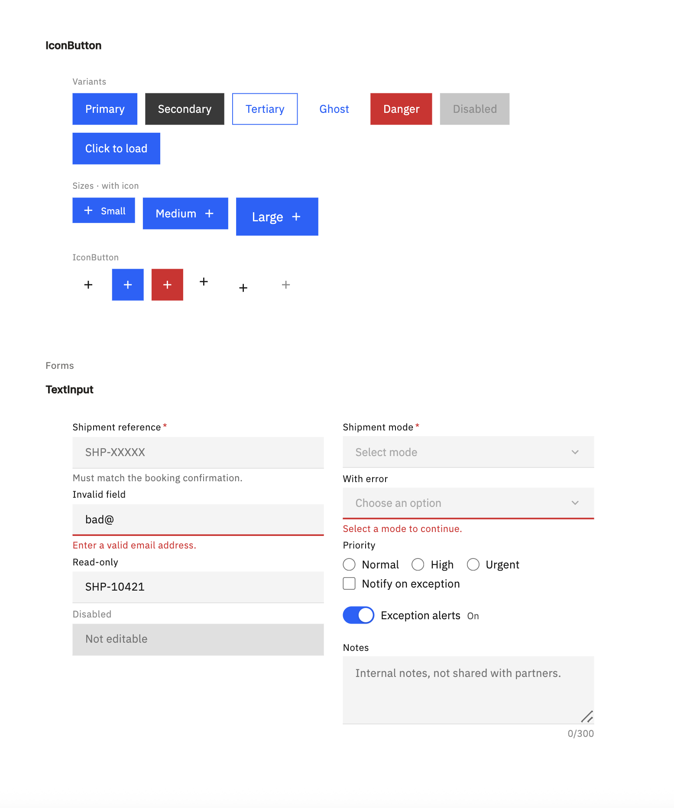

# Enterprise UI Kit




Enterprise screens (ERP/SCM/FSM) design system compatible with [SAP Foundation] on React, Vue, Angular (official), Flutter, and SAP OpenUI5 Web Components. Supports ~120 components split cleanly into primitives, data display, and navigation, and it explicitly separates "what it looks like" from "what it does". Defines only UI/UX (component index, content-density, context-menu conventions, best practices, guidlines), style-agnostic.

## References

- Flexport's [Designing the new operating system for global trade](https://medium.com/flexport-ux/designing-the-new-operating-system-for-global-trade-at-flexport-ce84b7052032) case study, which frames dense operational tools as manipulation surfaces rather than dashboards — the same posture this kit assumes.

## Usage

```
# Open or create your project folder
cd ~/project                    # or mdkir -p ~/project && cd ~/project

# Download the repository — no .git
curl -L https://github.com/vadim-a-yegorov/uikit/archive/refs/heads/main.zip -o /tmp/uikit.zip && unzip -q /tmp/uikit.zip -d /tmp && cp -R /tmp/uikit-main/. .

# Fill or replace blank DESIGN.md once per project
mv DESIGN.Carbon_V11.md DESIGN.md
```
